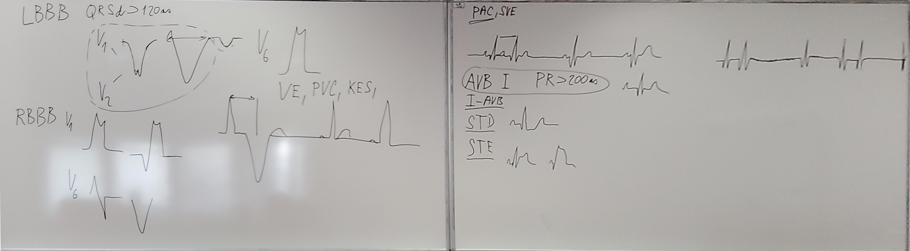

# BUTTeam PhysioNetCHallenge2020

[odkaz challange](https://physionetchallenges.github.io/2020/#rules-and-deadlines)

## Patologie:

1. Normal sinus rhythm (Normal)
2. Atrial fibrillation (AF)
3. First-degree atrioventricular block (I-AVB)
4. Left bundle branch block (LBBB)
5. Right bundle branch block (RBBB)
6. Premature atrial complex (PAC)
7. Premature ventricular complex (PVC)
8. ST-segment depression (STD)
9. ST-segment elevation (STE)

## co zkusit:
- [x] crossvalidační enamble
- [x] předučení na našich datech - znoršuje

- [ ] replikace signálů místo doplňování nulama
- [ ] augmentace prodlužováním a zkracováním (nalepit na konec kus z prostředka)
- [ ] síť jako google net - ruzné druhy konvolucí a ať si síť vybere sama
- [ ] attention vrstva (už sem zkoušel ale nefungovala - comity 'implementace attentin místo poolingu' a 'nefunkční transformer :(')
- [ ] augmentace pomocí GAN
- [ ] optimalzace hyperparametrů - nejlíp Bayesovská ;)

